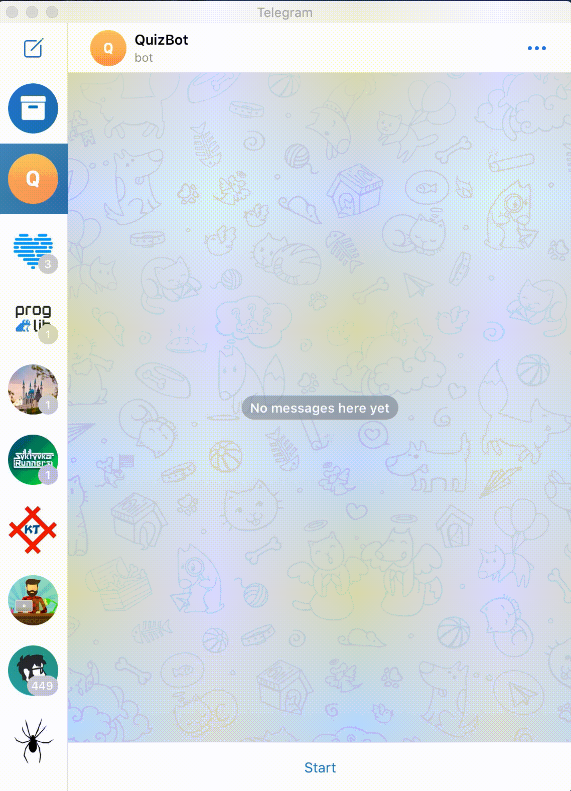

# Бот для викторин

Боты для телеграмма и вконтакте по проведению викторины.

Примеры ботов: [телеграмм](t.me/StudentQuizBot) и группа [вконтакте](https://vk.com/public199145498)



## Как установить

Для работы бота нужен Python версии не ниже 3.6.

```bash
pip install -r requirements.txt
```

и настроенные переменные окружения:

- `QUIZ_TELEGRAM_BOT_TOKEN` - токен для телеграмм бота
- `QUIZ_VK_TOKEN` - токен для бота вконтакте
- `REDIS_HOST` - хост для Redis
- `REDIS_PORT` - порт для Redis
- `REDIS_PASSWORD` - пароль для Redis
- `NOTIFICATION_TELEGRAM_TOKEN` - токен для бота телеграм для отправки уведомелний администратору
- `NOTIFICATION_TELEGRAM_CHAT_ID` - id чата в телеграмме с администратором для отправки уведомелний

Также необходимо создать подключение к Redis на [сайте](https://redislabs.com/).

Вопросы для викторины находятся в файле `questions.txt`.

## Как запустить телеграмм бота

```bash
python tg_bot.py
```

## Как запустить бота вконтакте

```bash
python vk_bot.py
```
